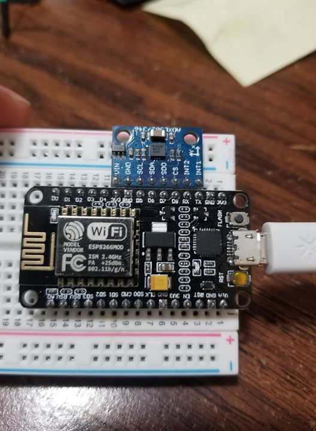
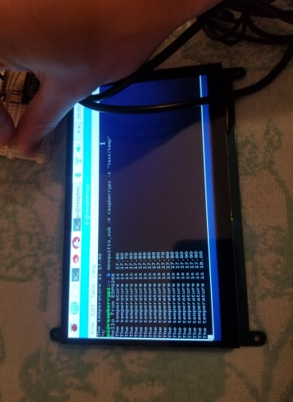
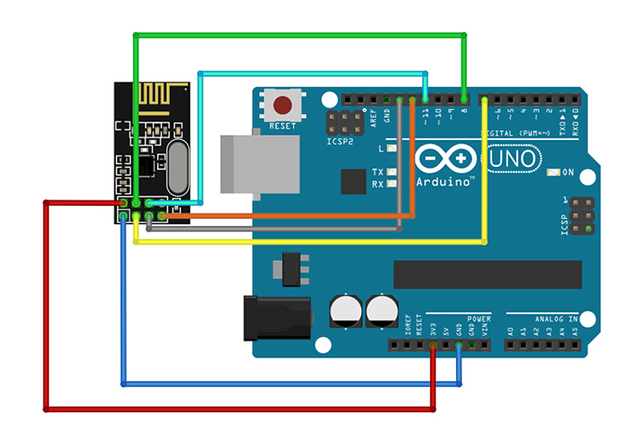
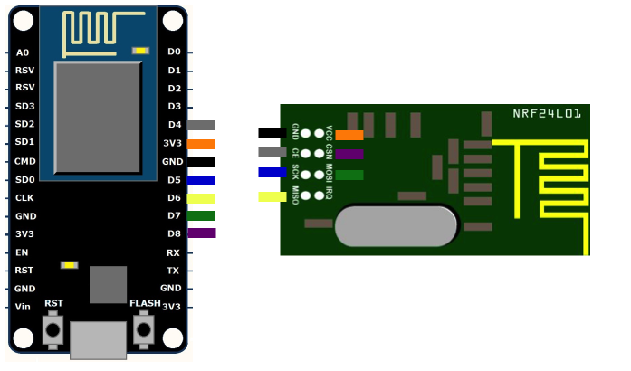
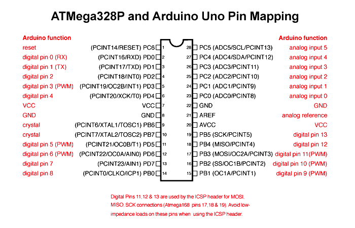

For this first part of the project we'll be setting up the a mosquitto MQTT server with a RPi being the server and an ESP8266 as a client. Later the ESP will be the master node of a mesh network between it and two Arduino Unos. MQTT is a convenient subscribe and publish system where messages can be published/subscribed under a certain topic by a client.

On the raspberry pi, via the terminal or command line, enter

| `sudo apt install mosquitto mosquitto-clients`

in order to install the mosquitto MQTT broker using the apt package manager.

Now to enable the broker, run:

`sudo systemctl enable mosquitto`

The broker status can be confirmed via (should display running in green):

`sudo systemctl status mosquitto`

### Setting up the ESP8266 

I used the Arduino IDE, so a couple things that had to be done were:

- Navigate to Tools --> Board, and select "NodeMCU 1.0 (ESP-12E Module)"
- In Tools, Select the correct port where the board is attached
- In Tools --> Manage Libraries, install the PubSubClient library to connect to the MQTT server.

In order to see what the sensors are publishing from the Rpi, enter

`mosquitto_sub -h hostname -t "test/message"`

where the standard hostname for a RPi is raspberrypi and test/message is whatever topic you wish to subscribe to.

#### Accelerometer (ADXL362)

Setting up the accelerometer is quite simple, as the pins are already in order as the ESP8266 requires them to be (The CLK, MOSI, MISO, CS...). Now just upload the code given in esp8266_accel and it should output the x, y, z values for acceleration.

#### Temperature Sensor (DHT 22 (AM2302))

For the sensor, connect Pin 1 to Vin on the ESP8266, Pin 2 to GPIO2 (any GPIO pin will work), and Pin 4 to Gnd. Code is given under the esp8266_temp folder. Notice that the sensor gives readings around 17-18 degrees, which is quite cold but makes sense as it was in a basement.

### Setting up the Mesh Network

For the mesh network of 2 arduinos and the ESP8266, nrf24l01 transceivers were used. Connections for both are shown below. For the ESP8266 connection, a 3.3K resistor was added between D8 and GND in order to allow HSPI to work properly.

With one arduino with a temperature sensor and the other with an accelerometer, they can send data to the master node (ESP8266)  through each other or directly, depending on the distance between the nodes. 

#### Running on the ATMega328 Chips

In order to run on the chips alone, rewire the components based on the pin mapping given below, and power the VCC pin with 5V. Note that the nrf24l01 runs on 3.3V, so a level converter should be used.

